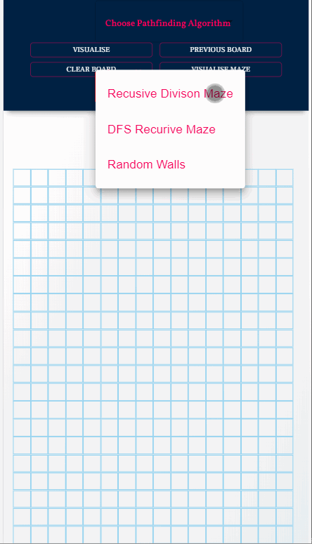
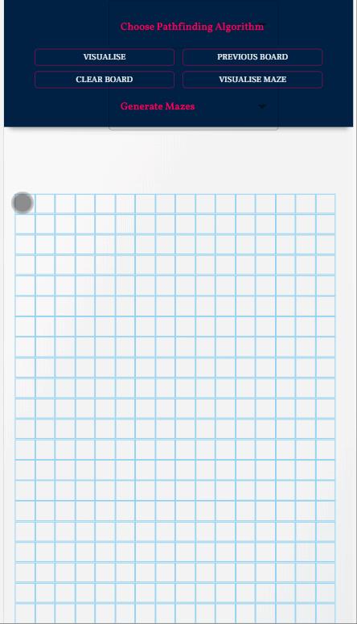

#  Pathfinding Visualiser
You must've heard of many pathfinding algorithms but do you ever wonder how they work?
This is a pathfinding visualiser where you can visualise some of the famous pathfinding algorithms and see how they really work for finding the path between source and destination. Play with this tool and gain some knowledge about fascinating pathfinding algorithms.
## Features
* One source and one destination anywhere in the board.
* You can also draw walls to block path from source to destination.Path will never go through the wall.
* Maze generation using different maze generation algorithms.
    * *DFS recursice backtarcking maze algorithm*
    * *Recursive divison maze algorithm*
    * *Random Walls - using kruskal's algorithm*
* Reset the board to same source and destination.
* Reset the board to initial state i.e totally clear.
* Optimized web-app for small,medium and large screen devices.

## Implemented Algorithms
* *A  star search*(weighted) - Arguably, the best pathfinding algorithm, uses heuristics to guarantees the shortest path much faster than Dijkstra's Algorithm.
* *Dijkstra Search*(weighted) - One of the best pathfinding algorithms. It guarantees the shortest path from source to destination.
* *Breadth First Search*(unweighted) - Great algorithm, it guarantees the shortest path but works slower than then dijkstra algorithm.
* *Depth Birst Search* (unweighted) - Not a good choice for pathfinding algorithms, doesn't guarantees the shortest path.
* *Bi-directional BFS* (unweighted) - Great algorithm, runs two breadth first search, from source and destination. It guarantees the shortest path and much faster than single breadth first search.

#### *NOTE: Read the instructions before using the tool as it can be quiet tricky to use for first time.*

 

Also, inspired by [Clement Mihailescu]("")

This project was bootstrapped with [Create React App](https://github.com/facebook/create-react-app).

## Available Scripts

In the project directory, you can run:

### `npm start`

Runs the app in the development mode. 
Open [http://localhost:3000](http://localhost:3000) to view it in the browser.

The page will reload if you make edits. 
You will also see any lint errors in the console.

### `npm test`

Launches the test runner in the interactive watch mode. 
See the section about [running tests](https://facebook.github.io/create-react-app/docs/running-tests) for more information.

### `npm run build`

Builds the app for production to the `build` folder. 
It correctly bundles React in production mode and optimizes the build for the best performance.

The build is minified and the filenames include the hashes. 
Your app is ready to be deployed!

See the section about [deployment](https://facebook.github.io/create-react-app/docs/deployment) for more information.

### `npm run eject`

**Note: this is a one-way operation. Once you `eject`, you can’t go back!**

If you aren’t satisfied with the build tool and configuration choices, you can `eject` at any time. This command will remove the single build dependency from your project.

Instead, it will copy all the configuration files and the transitive dependencies (webpack, Babel, ESLint, etc) right into your project so you have full control over them. All of the commands except `eject` will still work, but they will point to the copied scripts so you can tweak them. At this point you’re on your own.

You don’t have to ever use `eject`. The curated feature set is suitable for small and middle deployments, and you shouldn’t feel obligated to use this feature. However we understand that this tool wouldn’t be useful if you couldn’t customize it when you are ready for it.

## Learn More

You can learn more in the [Create React App documentation](https://facebook.github.io/create-react-app/docs/getting-started).

To learn React, check out the [React documentation](https://reactjs.org/).

### Code Splitting

This section has moved here: https://facebook.github.io/create-react-app/docs/code-splitting

### Analyzing the Bundle Size

This section has moved here: https://facebook.github.io/create-react-app/docs/analyzing-the-bundle-size

### Making a Progressive Web App

This section has moved here: https://facebook.github.io/create-react-app/docs/making-a-progressive-web-app

### Advanced Configuration

This section has moved here: https://facebook.github.io/create-react-app/docs/advanced-configuration

### Deployment

This section has moved here: https://facebook.github.io/create-react-app/docs/deployment

### `npm run build` fails to minify

This section has moved here: https://facebook.github.io/create-react-app/docs/troubleshooting#npm-run-build-fails-to-minify
